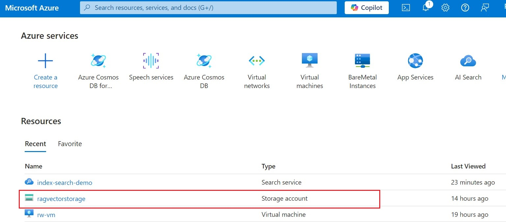
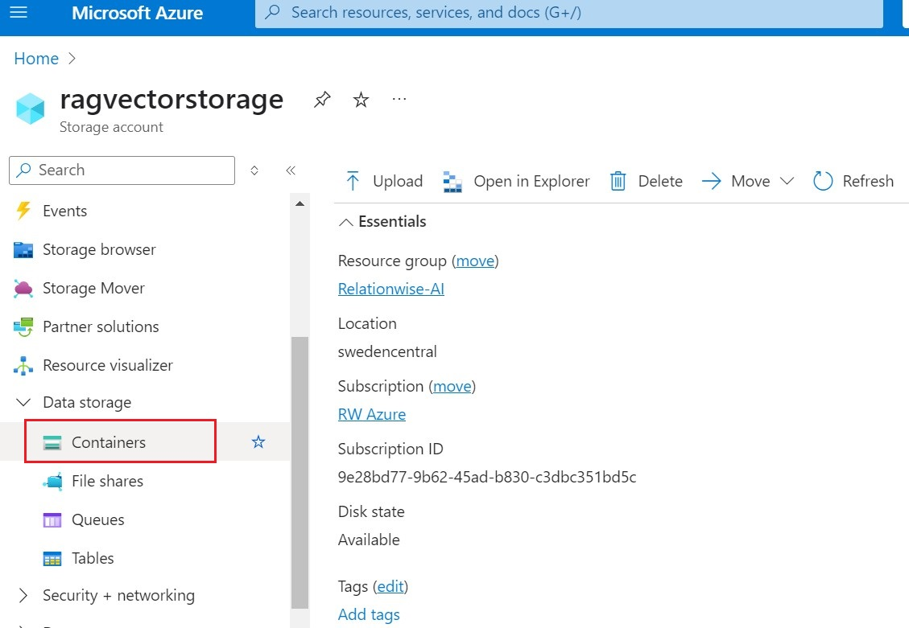
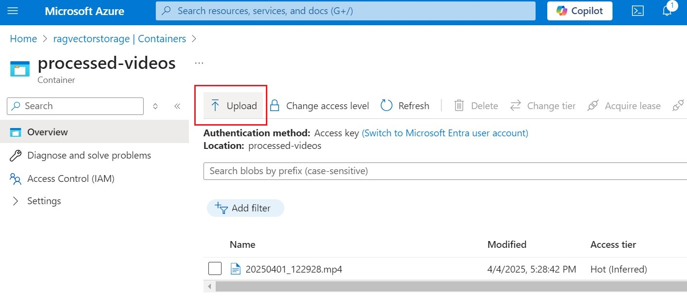
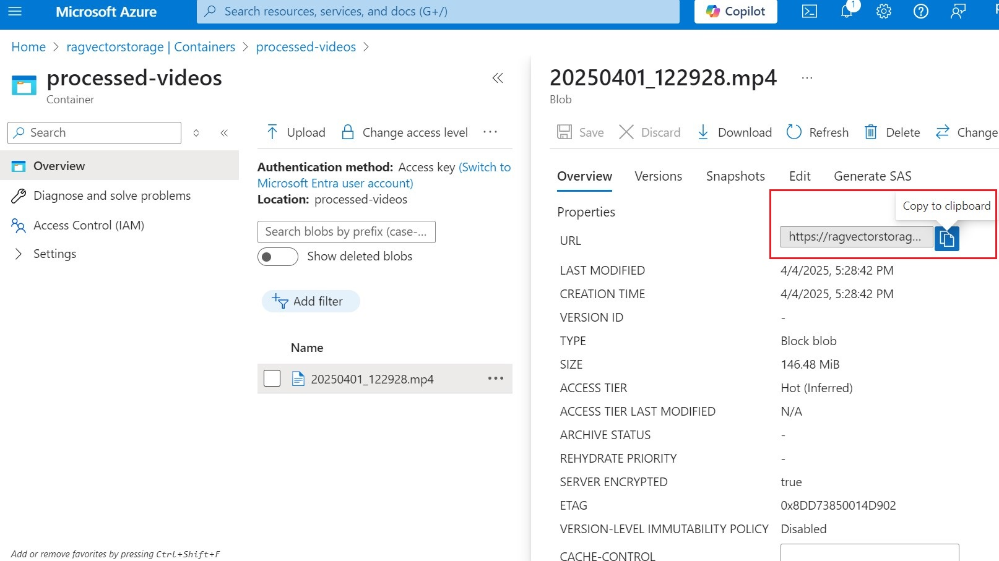

# 🔹 Uploading a File to Azure Blob Storage and Getting a Shareable URL

1. Go to Azure Portal
Open https://portal.azure.com and navigate to your Storage Account.

2. Open Blob Containers
In the left sidebar, under Data storage, click Containers, then select or create a container (set it to Blob (anonymous read access) if you want a public link).

3. Upload Your File
Inside the container, click Upload, choose your file, and click Upload again.

4. Copy File URL
After upload, click on the file name. In the properties panel, copy the Blob URL — this is the link you'll use in the url field when uploading to the knowledge base.
